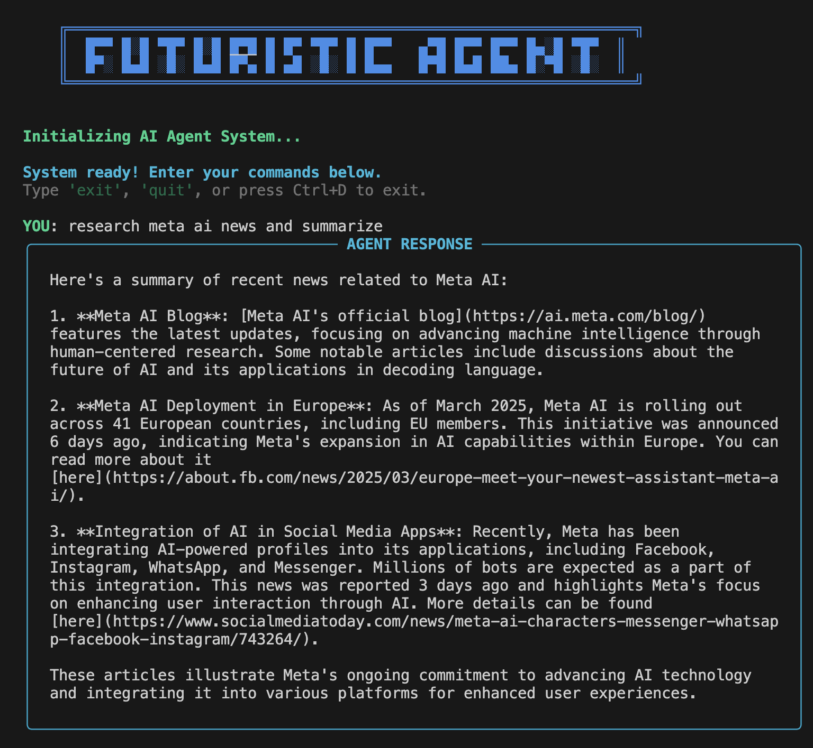

# Simple Agentic Framework



A lightweight Python framework for building agentic AI applications using the OpenAI API. This framework allows you to create AI agents that can use tools to accomplish objectives.

## Features

- 🧠 Create agents with specific objectives
- 🛠️ Define custom tools that agents can use
- 🔄 Automatic handling of tool calls and responses
- 💬 Managed conversation flow with the OpenAI API
- 🪶 Lightweight design with minimal dependencies

## Installation

1. Clone this repository or copy the files into your project
2. Install the required dependencies:

```bash
pip install -r requirements.txt
```

3. Set your OpenAI API key as an environment variable:

```bash
export OPENAI_API_KEY=your_api_key_here
```

4. If you plan to use search functionality, you'll need a SerpAPI key:
   - Sign up for a free account at [SerpAPI](https://serpapi.com/)
   - Copy your API key from the dashboard
   - Set it as an environment variable:

```bash
export SERPAPI_API_KEY=your_serpapi_key_here
```

## Command Line Interface

The framework includes a user-friendly command-line interface that allows you to interact with your agent directly:

```bash
python main.py
```

### CLI Features:

- 🌈 **Rich Text Interface**: Beautiful, colorful console output with formatted responses
- 🔄 **Tool Usage Tracking**: Displays which tools the agent used to fulfill your request
- 📜 **Command History**: Remembers your previous commands for easy recall
- 🛠️ **Automatic Tool Integration**: Tools are automatically loaded and available
- ⌨️ **Interactive Commands**: Type 'exit' or 'quit' to end the session, or use Ctrl+D

The CLI starts by initializing the agent with your available tools. If you have a SerpAPI key configured, the search functionality will be enabled automatically.

## Project Structure

The framework consists of just 4 files:

- `agent.py`: Core Agent class that manages objectives and tool execution
- `tools.py`: Base Tool class and example implementations
- `conversation.py`: Manages interactions with the OpenAI API
- `main.py`: Example usage and CLI implementation

## Usage

### Basic Example

```python
from agent import Agent
from tools import Calculator, WebsiteFetcher

# Create an agent with an objective
agent = Agent(objective="Help the user solve math problems and fetch web content")

# Add tools to the agent
calculator_tool = Calculator()
website_fetcher_tool = WebsiteFetcher()
agent.add_tool(calculator_tool)
agent.add_tool(website_fetcher_tool)

# Run the agent with a user query
result = agent.run("Calculate 25 * 13 and then fetch the content from https://example.com")

# Print the final response
print(result[-1]["content"])
```

### Creating Custom Tools

You can create custom tools by extending the `Tool` class:

```python
from tools import Tool
import json

class WeatherTool(Tool):
    def __init__(self):
        super().__init__(
            name="get_weather",
            description="Get the current weather for a location",
            parameters={
                "type": "object",
                "properties": {
                    "location": {
                        "type": "string",
                        "description": "The city and state/country"
                    }
                },
                "required": ["location"]
            }
        )

    def execute(self, arguments: str) -> str:
        args = json.loads(arguments)
        location = args["location"]
        # In a real implementation, you would call a weather API here
        return f"It's 72°F and sunny in {location}"
```

### Available Tools

The framework comes with several built-in tools:

1. **Calculator** - Performs basic arithmetic operations (add, subtract, multiply, divide)
2. **WebsiteFetcher** - Fetches content from a specified URL and returns a summary with content preview
3. **WebSearch** - Search the web using SerpAPI (requires SERPAPI_API_KEY environment variable to be set)

### Customizing the Agent

You can customize the agent with different models and system messages:

```python
agent = Agent(
    objective="Help with travel planning",
    model="gpt-4",
    system_message="You are a travel assistant that helps plan trips."
)
```

## Advanced Usage

### Running Multi-Turn Conversations

The agent can handle multi-turn conversations automatically:

```python
# This will continue the conversation for up to 5 turns if needed
results = agent.run("Help me plan a trip to Paris", max_turns=5)
```

### Manually Sending Messages

You can also manually control the conversation:

```python
agent = Agent(objective="Help with coding questions")
response = agent.send_message("How do I write a recursive function in Python?")
follow_up = agent.send_message("Can you show me an example with factorial?")
```

## Requirements

- Python 3.7+
- Required packages:
  - openai>=1.10.0
  - requests>=2.31.0
  - rich>=13.0.0

## License

MIT

```

```
